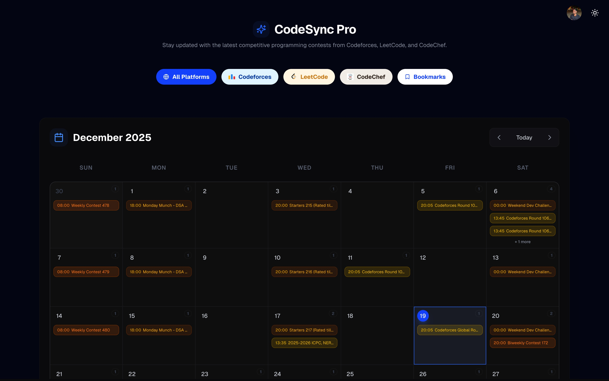

# CodeSync Pro

> **Advanced Competitive Programming Analytics Platform**

CodeSync Pro is a comprehensive analytics and performance tracking platform designed for competitive programmers. It provides real-time insights, intelligent recommendations, and detailed performance analytics across multiple programming platforms.

Live Demo: [https://codesync-xgdu.onrender.com](https://codesync-xgdu.onrender.com)



## 🚀 Key Features

* **Smart Tracking:** Live contests from Codeforces, LeetCode, CodeChef, and more.
* **Intelligent Insights:** Personalized difficulty predictions and skill-based recommendations.
* **Smart Alerts:** Automated email reminders and timezone-aware notifications.
* **Modern UI:** Responsive, dashboard-style interface with Dark/Light mode support.
* **Advanced Filtering:** Powerful search and status tracking (Upcoming/Live/Completed).

## 🛠 Tech Stack

### **Frontend**
- **Next.js 15** - React framework with App Router
- **TypeScript** - Type-safe development
- **Tailwind CSS** - Utility-first styling
- **Framer Motion** - Smooth animations
- **Radix UI** - Accessible component primitives
- **Recharts** - Interactive data visualization

### **Backend & Data**
- **MongoDB** - Document database for flexible data storage
- **TanStack Query** - Powerful data fetching and caching
- **Zod** - Runtime type validation
- **Axios** - HTTP client with interceptors

### **Development Tools**
- **ESLint** - Code linting and formatting
- **Prettier** - Code formatting
- **Husky** - Git hooks for quality assurance

## 🏗 Architecture

```
src/
├── app/                    # Next.js App Router
│   ├── api/               # API routes
│   │   ├── contests/      # Contest data endpoints
│   │   ├── analytics/     # Analytics endpoints
│   │   └── notifications/ # Notification services
│   └── globals.css        # Global styles
├── components/            # Reusable UI components
│   ├── ui/               # Base UI components
│   └── features/         # Feature-specific components
├── features/             # Feature modules
│   ├── analytics/        # Analytics dashboard
│   ├── contests/         # Contest management
│   └── notifications/    # Notification system
├── hooks/                # Custom React hooks
├── providers/            # Context providers
├── services/             # API services
├── types/                # TypeScript definitions
├── utils/                # Utility functions
└── constants/            # Application constants
```

## 🚦 Getting Started

### Prerequisites
- Node.js 18+ 
- MongoDB instance
- npm/yarn/pnpm

### Installation

1. **Clone the repository**
```bash
git clone https://github.com/yourusername/codesync-pro.git
cd codesync-pro
```

2. **Install dependencies**
```bash
npm install
# or
yarn install
# or
pnpm install
```

3. **Environment Setup**
Create a `.env.local` file:
```env
# Database
MONGODB_URI=mongodb://localhost:27017/codesync-pro

# API Configuration
NEXT_PUBLIC_API_URL=http://localhost:3000
NEXT_PUBLIC_APP_URL=http://localhost:3000

# External APIs
YOUTUBE_API_KEY=your_youtube_api_key
CODEFORCES_API_URL=https://codeforces.com/api
LEETCODE_API_URL=https://leetcode.com/api
CODECHEF_API_URL=https://codechef.com/api

# Email Service (Optional)
SMTP_HOST=smtp.gmail.com
SMTP_PORT=587
SMTP_USER=your_email@gmail.com
SMTP_PASS=your_app_password
```

4. **Run the development server**
```bash
npm run dev
# or
yarn dev
# or
pnpm dev
```

5. **Open your browser**
Navigate to [http://localhost:3000](http://localhost:3000)

## 📱 API Endpoints

### Contest Management
- `GET /api/contests` - Fetch all contests with filtering
- `GET /api/contests/[platform]` - Platform-specific contests
- `POST /api/contests/bookmark` - Bookmark/unbookmark contests

### Analytics
- `GET /api/analytics/performance` - User performance data
- `GET /api/analytics/trends` - Rating and participation trends
- `GET /api/analytics/platforms` - Platform-wise statistics

### Notifications
- `POST /api/notifications/subscribe` - Subscribe to contest reminders
- `PUT /api/notifications/preferences` - Update notification settings


## 🔧 Development

### Code Quality
```bash
# Linting
npm run lint

# Type checking
npm run type-check

# Build
npm run build
```

### Testing
```bash
# Unit tests
npm run test

# E2E tests
npm run test:e2e
```


## 🤝 Contributing

1. Fork the repository
2. Create a feature branch (`git checkout -b feature/amazing-feature`)
3. Commit your changes (`git commit -m 'Add amazing feature'`)
4. Push to the branch (`git push origin feature/amazing-feature`)
5. Open a Pull Request

---

**Built with ❤️ for the competitive programming community**
