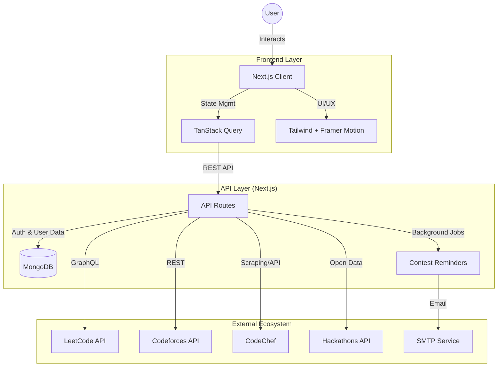

# CodeSync Pro

> **The Ultimate Developer Growth Ecosystem: Compete. Build. Connect.**

CodeSync Pro is not just for competitive programmers—it is a 360-degree developer ecosystem designed to accelerate your career growth. We bring together three distinct worlds into one powerful platform:

1.  **COMPETE:** Master algorithm skills with unified contest tracking.
2.  **BUILD:** Innovate and create by discovering global hackathons.
3.  **CONNECT:** Grow your network by finding and following peers.

**The Real-World Problem We Solve:**
Developers currently fragment their growth journey across dozens of isolated tabs—checking three different sites for contests, scrolling generic event lists for hackathons, and struggling to find peers on LeetCode. **CodeSync Pro unifies this entire ecosystem into a single, high-performance command center.**

Live Demo: [https://codesync-xgdu.onrender.com](https://codesync-xgdu.onrender.com)


## 🚀 Three Pillars of Excellence

### ⚔️ Pillar 1: COMPETE (Contest Intelligence)
Dominate the leaderboards by never missing a match.
-   **Unified Dashboard:** Synchronized schedules from **LeetCode, Codeforces, and CodeChef**.
-   **Smart Editorials:** Automatic mapping of past contests to their **video solutions** for instant learning.
-   **Performance Tracking:** Visualize your rating history and contest consistency across all platforms.

### 🌟 Pillar 2: BUILD (Hackathon Explorer)
Stop solving imaginary problems. Start building real solutions.
-   **Global Innovation Calendar:** Real-time aggregation of hackathons from around the world.
-   **Mode Filters:** Easily find **Online** (remote-friendly) or **Offline** (local) events.
-   **Featured Spotlights:** Curated list of high-value innovation challenges.

### 🤝 Pillar 3: CONNECT (Social Graph)
You are the average of the five people you code with.
-   **LeetCode Buddy Search:** A specialized search engine to find and follow friends on LeetCode.
-   **Deep Search Technology:** Intelligent fallback to a seeded database of **16,000+ users** ensures you find profiles even when APIs are strict.
-   **Peer Analytics:** View comparative stats and progress of your peers.

### 💎 Pillar 4: SHOWCASE (Portfolio Tracker)
Your hard work deserves to be seen.
-   **Cross-Platform Portfolio:** A single view combining **LeetCode, CodeForces, and CodeChef** stats.
-   **Unified Heatmap:** A GitHub-style activity graph that merges your daily submissions from all three platforms into one "Green Wall".
-   **Instant Developer Card:** Generate a premium, sharable image card of your year's achievements with one click.
-   **Visual Weakness Analysis:** Donut charts and trend lines to identify your strongest and weakest topics.

---

## 🏗 Architecture

We use a modern, scalable, and type-safe architecture to ensure high performance and reliability.



## 🛠 Tech Stack

### **Frontend Excellence**
- **Next.js 15** - The latest React framework with App Router for server-side rendering.
- **TypeScript** - Strict type safety for fewer bugs.
- **Tailwind CSS** - Rapid, utility-first styling.
- **Framer Motion** - Production-grade animations for that "wow" factor.
- **Radix UI** - Accessible, unstyled component primitives.
- **Lucide Icons** - Beautiful, consistent iconography.

### **Backend Power**
- **MongoDB** - Flexible document storage for user preferences and contest data.
- **TanStack Query** - Efficient server state management and caching.
- **Zod** - Robust schema validation.
- **Nodemailer** - Reliable email delivery service.

---

## 🚦 Getting Started

### Prerequisites
- Node.js 18+ 
- MongoDB instance (Local or Atlas)
- npm/yarn/pnpm

### Installation

1. **Clone the repository**
   ```bash
   git clone https://github.com/yourusername/codesync-pro.git
   cd codesync-pro
   ```

2. **Install dependencies**
   ```bash
   npm install
   ```

3. **Environment Setup**
   Create a `.env.local` file in the root directory:
   ```env
   # Database
   MONGODB_URI=mongodb://localhost:27017/codesync-pro

   # API Configuration
   NEXT_PUBLIC_API_URL=http://localhost:3000

   # External Integrations (Optional elements)
   YOUTUBE_API_KEY=your_key_here
   
   # Email Service (Required for Notifications)
   SMTP_HOST=smtp.gmail.com
   SMTP_PORT=587
   SMTP_USER=your_email@gmail.com
   SMTP_PASS=your_app_password
   ```

4. **Run the development server**
   ```bash
   npm run dev
   ```

5. **Open your browser**
   Navigate to [http://localhost:3000](http://localhost:3000)

---

## 📱 API Documentation

| Method | Endpoint | Description |
| :--- | :--- | :--- |
| `GET` | `/api/contests` | Fetch all aggregated contests |
| `GET` | `/api/hackathons` | Search and filter global hackathons |
| `GET` | `/api/search/users` | Find LeetCode profiles |
| `POST` | `/api/notifications/subscribe` | Subscribe to alerts |

---

## 🔧 Development Workflow

> **Note:** We use `husky` to ensure code quality before commits.

```bash
# Run Linter
npm run lint

# Run Type Check
npm run type-check
```

---

## 🤝 Contributing

1. Fork the repository
2. Create a feature branch (`git checkout -b feature/amazing-feature`)
3. Commit your changes (`git commit -m 'Add amazing feature'`)
4. Push to the branch (`git push origin feature/amazing-feature`)
5. Open a Pull Request

---

**Built with ❤️ for the competitive programming community**

